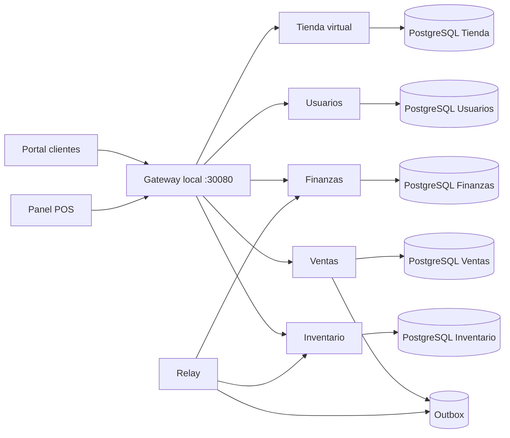

# Software Architecture Document (SAD)

## Propósito y contexto

Happy Donut separa ventas, inventario, finanzas, usuarios y tienda virtual en bounded contexts autónomos. Cada backend posee PostgreSQL propio y expone un Open Host Service HTTP documentado en `openapi/openapi.yaml`.

## Vista de módulos

La dependencia es hacia dentro: `HTTP/Infraestructura -> Aplicación -> Dominio`. Dominio contiene agregados, entidades, value objects y puertos sin importar Laravel o Eloquent. Aplicación coordina casos de uso y transacciones. Infraestructura implementa persistencia, transporte y telemetría.

## Consistencia e integración

El pago modifica la orden y agrega `VentaFinalizada.v1` a la outbox en una sola transacción. El relay entrega por HTTP autenticado con reintentos. Inventario y Finanzas guardan `evento_id` junto con sus cambios, logrando consumo idempotente bajo entrega al menos una vez. No existen transacciones distribuidas ni acceso cruzado a tablas.

## Vista de despliegue local

Docker Desktop Kubernetes ejecuta cinco servicios, dos frontends, gateway, relay, cinco StatefulSets PostgreSQL, Redis y RabbitMQ. El namespace `observability` contiene Prometheus, Grafana, Tempo y OpenTelemetry Collector. Argo CD reside en `argocd`; Chaos Mesh en `chaos-mesh`.

Probes `/up`, requests/limits, PDB, HPA y NetworkPolicy están versionados. Las imágenes locales usan `:local`; la promoción productiva reemplaza etiquetas por SHA.

## Seguridad

Sanctum emite bearer tokens. El canal interno de eventos exige `X-Eventos-Secret`. Los pods de aplicación no elevan privilegios y eliminan capabilities. Los secretos locales son didácticos; producción exige External Secrets, TLS, políticas del gateway y rotación.

## Observabilidad y operación

Middleware RED expone contadores e histogramas Prometheus. La instrumentación OpenTelemetry de Laravel/PDO exporta OTLP al Collector y Tempo. Las reglas SLO y dashboard se encuentran en `observability/`; el procedimiento y presupuesto, en `docs/sre/SLI-SLO.md`.

## Decisiones relacionadas

Consultar `docs/adr/`, especialmente ADR 005 para Kubernetes local, outbox y OpenTelemetry.

## Riesgos residuales

El clúster local es de un solo nodo: valida manifiestos, recuperación de pods y operación, pero no demuestra tolerancia a pérdida física de nodo. Un entorno público requiere DNS/TLS, registro, almacenamiento y secretos administrados. Los resultados de cobertura, mutación, SLO y caos solo son válidos después de ejecutarse sobre el SHA entregado.
