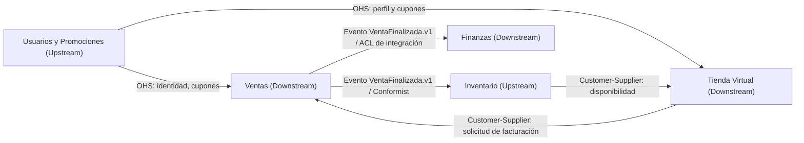

# Context Map

Cada contexto posee PostgreSQL propio y no consulta tablas ajenas. OHS se publica mediante OpenAPI. La ACL de Finanzas traduce el evento de Ventas a `MovimientoCaja` y `AcumuladoRus`; Inventario reacciona idempotentemente al mismo evento. No se usa Shared Kernel entre dominios.