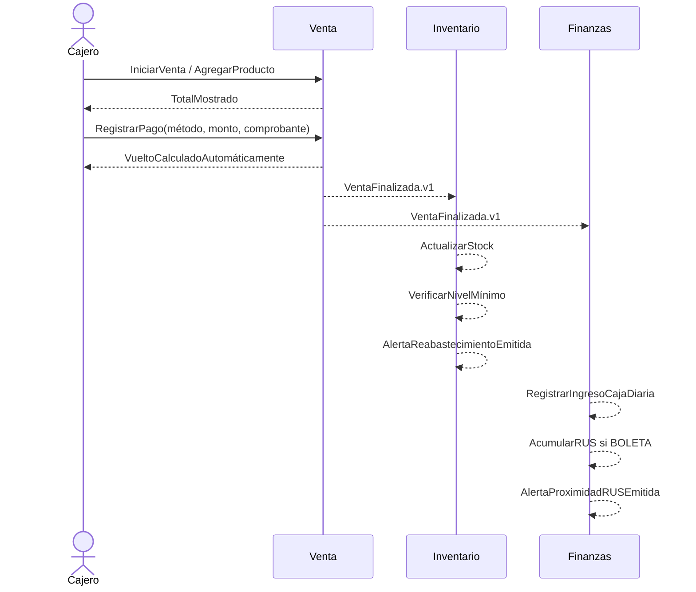

# Crónica de Event Storming

Fuente: entrevista a Kelly Flores y documento de microservicios. Se identificaron actores (Kelly, cajero, cliente online), comandos azules, eventos naranjas, agregados amarillos, políticas moradas y riesgos rojos.

Hot spots resueltos: web y POS no comparten promociones implícitamente; Inventario decide disponibilidad; solo Boleta acumula RUS; Yape/Plin no generan vuelto. Pendientes operativos: proveedor real de delivery, reglas de un solo uso de cupón y homologación SUNAT.